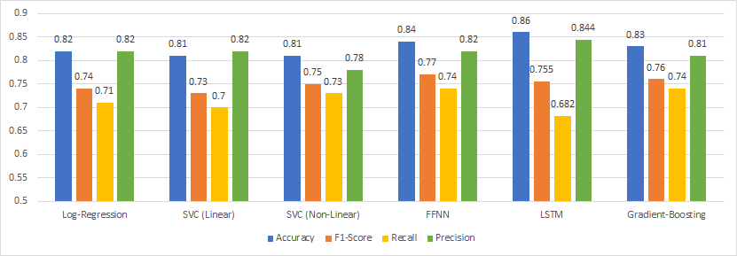

# NLP Approaches for Tweets' Classification
In this Tweet classification project, we use several methods, including neural methods such as LSTM and FFNN, as well as traditional machine learning methods such as Logistic Regression and SVM, to classify tweets as written by Donald Trump or his staffers. For the neural methods we trained Word2Vec embedding vectors using pyTorch (see w2v.txt). Examples for several features' distribution is presented in the notebook, demonstrating part of the feature selection process.

As seen from the comparison chart, the best results were obtained by the LSTM model. However, it was indeed a close battle, with all other classifiers reaching accuracy results of over 80%. One reason that could explain the LSTM improved results, may be that it was the only model in which the features (the words embedding-vectors) were inserted into the model in a sequential manner. President Trump is famously known for his unique use of language and choice of words, which often departs from the typical political style. Therefore, it could directly explain the improved performance of an algorithm such as LSTM, which takes into account the individual’s use of language and sequential selection of words, thus ‘assisting’ the algorithm to better distinguish between Trump and his staffers.
